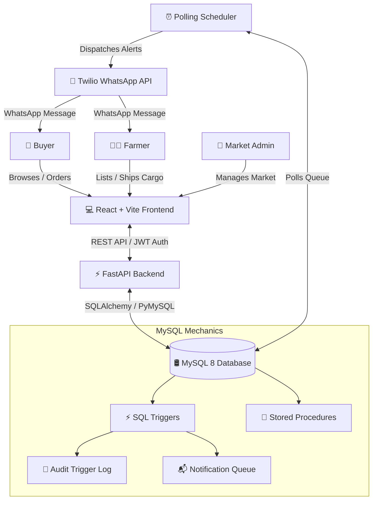

# 🌾 AgriFlow Direct — Farmer Market Connect

> **A Comprehensive Full-Stack College DBMS Mini-Project**  
> Streamlining supply chains by connecting local farmers directly with buyers, powered by MySQL triggers, stored procedures, audit logging, FastAPI, React, and Twilio WhatsApp notifications.

---

## 📌 Project Overview
**AgriFlow Direct** (Farmer Market Connect) is a modern, responsive, role-based e-commerce platform designed to eliminate middlemen in agriculture. By connecting local farmers directly to retail and wholesale buyers, it ensures farmers receive fair pricing and buyers get fresh, traceable harvests. 

As a **DBMS-centric showcase**, the project leverages advanced database management features—including complex relational constraints, performance indexing, automatic transaction audit logging, and data-driven recommendations computed entirely via SQL stored procedures and self-joins.

---

## ⚡ Technical Stack

*   **Frontend**: React (Vite, modern responsive CSS system)
*   **Backend**: FastAPI (Python), SQLAlchemy ORM (for schema migrations & standard queries), PyMySQL
*   **Database**: MySQL 8.0+ (utilizing triggers, stored procedures, indexes, self-joins, and transaction logs)
*   **Auth**: JWT (JSON Web Tokens) with role-based access control (Farmer / Buyer / Admin)
*   **Notification Engine**: Twilio WhatsApp API integrated with an asynchronous polling worker

---

## 🏗️ System Architecture



---

## 🌟 Key Features & Actor Workflows

### 👩‍🌾 The Farmer
*   **Farm Listing**: Set farm details, regional market base, and contact details.
*   **Crop Management**: Add, update, or remove crop details, inventory stock levels, and real-time pricing.
*   **Order Tracking**: Receive automatic alerts when a buyer orders their items; update order status from `pending` to `shipped` to release fresh cargo.

### 🛒 The Buyer
*   **Fresh Market**: Browse harvests by categories (Vegetables, Fruits, Grains, Dairy).
*   **Secure Checkout**: Place orders which deduct stock atomically and register transactions.
*   **Intelligent Recommendations**: Browse a custom recommendations feed driven by product-affinity analysis.
*   **WhatsApp Updates**: Receive real-time checkout confirmations and transit status changes on their phone.

### 🔑 The Market Admin
*   **Market Registry**: Create and manage physical local markets.
*   **Directory Management**: Monitor crop listings, system-wide sales volumes, and farmer distribution profiles.

---

## 🛢️ DBMS Deep-Dive: Architecture & Mechanics

This project is built to demonstrate critical industrial database management practices:

### 1. Database Schema Design
The relational schema comprises 11 well-defined tables structured in 3rd Normal Form (3NF) to ensure data consistency and eliminate redundancy.

*   `MARKET`: Physical marketplaces where farmers sell.
*   `BUYER`: Customer profiles, shipping info, and WhatsApp-enabled contacts.
*   `FARMER`: Farmer profile, farm credentials, and physical marketplace mapping.
*   `PRODUCT`: Crop inventory, category mapping, pricing, and check constraints (`price >= 0`, `stock_quantity >= 0`).
*   `ORDER`: Purchase transaction heads (`status`: pending, confirmed, shipped, delivered).
*   `ORDER_ITEM`: Granular purchase rows mapping crops to orders at historical unit prices.
*   `REVIEW`: Quality rating values strictly validated between 1 and 5.
*   `NOTIFICATION_QUEUE`: Outbound notifications buffering stage.
*   `NOTIFICATION_TRIGGER_LOG`: System-wide audit table tracking database events.
*   `PRODUCT_SIMILARITY`: Matrix storing similarity scores between crops.
*   `BUYER_RECOMMENDATION`: Custom scores suggesting new harvests to buyers.

---

### 2. Database Triggers (Automated Events & Auditing)
Triggers are implemented in pure SQL (`database/triggers.sql`) to ensure that notification events are decoupled from the application level:

*   **`tr_order_after_insert`**: Fires when a new order is recorded. Retrieves the buyer's contact details, places an customized checkout receipt in the `NOTIFICATION_QUEUE`, and creates an entry in `NOTIFICATION_TRIGGER_LOG`.
*   **`tr_order_item_after_insert`**: Fires for every distinct crop in a placed order. Automatically identifies the corresponding farmer, formats an alert message notifying them of the new demand, queues it in `NOTIFICATION_QUEUE`, and writes an audit log.
*   **`tr_order_after_update`**: Monitors state updates in `ORDER`. If the status changes (e.g. from `pending` to `shipped`), it automatically queues a transit alert to the customer's WhatsApp and updates the audit trail.

**Audit Logging Pattern Example:**
```sql
CREATE TRIGGER tr_order_after_insert
AFTER INSERT ON `ORDER`
FOR EACH ROW
BEGIN
    -- ... notification code ...
    INSERT INTO NOTIFICATION_TRIGGER_LOG (trigger_name, action_type, record_id, details)
    VALUES (
        'tr_order_after_insert',
        'INSERT',
        NEW.order_id,
        CONCAT('Order #', NEW.order_id, ' placed successfully for Buyer ID ', NEW.buyer_id)
    );
END;
```

---

### 3. Stored Procedures (Data Analytics & Self-Joins)
Stored procedures (`database/procedures.sql`) process complex data relationships entirely inside the MySQL engine, optimizing latency:

*   **`compute_product_similarity()`**:
    Performs a **Self-Join** on the `ORDER_ITEM` table to identify products purchased together. It calculates the **Jaccard Similarity Index** for each product pair:
    $$\text{Similarity}(A, B) = \frac{\text{Orders with both } A \text{ and } B}{\text{Orders with } A + \text{Orders with } B - \text{Orders with both}}$$
    The results are saved directly to `PRODUCT_SIMILARITY`.
    
*   **`generate_recommendations(buyer_id)`**:
    Examines a buyer’s purchase history, aligns it with the calculated `PRODUCT_SIMILARITY` table, ranks top-scoring items that the buyer *has not yet purchased*, and saves the personalized selection into `BUYER_RECOMMENDATION`.

---

### 4. Indexing & Optimization
Specific indexes are created to optimize high-traffic queries:
*   `idx_product_category`: Speeds up market browse filtering.
*   `idx_order_status`: Optimizes backend dashboard reports.
*   `idx_order_buyer`: Speeds up customer order history retrieval.
*   `idx_notification_status`: Crucial for the background scheduler to quickly fetch and dispatch `pending` messages.

---

## 📁 Repository Structure
```
Farmer-Market-Connect/
│
├── database/                   # Pure SQL DB Scripts
│   ├── schema.sql              # Table creation & constraints
│   ├── triggers.sql            # Event-based Triggers & Audit Logs
│   ├── procedures.sql          # Similarity & Recommendation procedures
│   └── seed_data.sql           # Initial mock records
│
├── backend/                    # FastAPI Server Application
│   ├── routes/                 # Endpoint routers (Auth, Farmer, Buyer, Admin, Recommendations)
│   ├── main.py                 # Core app entry point & lifespan management
│   ├── models.py               # SQLAlchemy schema definitions
│   ├── scheduler.py            # WhatsApp polling worker (Twilio interface)
│   ├── schemas.py              # Pydantic request/response schemas
│   └── requirements.txt        # Python backend dependencies
│
├── frontend/                   # React Web Application
│   ├── src/
│   │   ├── App.jsx             # Comprehensive, interactive app layout
│   │   ├── index.css           # Global custom CSS styles
│   │   └── main.jsx            # React initial bootstrap
│   └── package.json            # Vite & frontend configurations
│
├── .env.example                # Sample environment variables configuration
├── reseed_db.py                # Database setup/re-seed helper script
└── README.md                   # Project documentation (You are here)
```

---

## 🚀 Setup & Execution Guide

### Prerequisites
*   **Python 3.10+** (Ensure it is added to your environment `PATH`)
*   **MySQL Server 8.0+**
*   **Node.js & npm** (For the React web client)

---

### Step 1: Database Setup
1.  Open your MySQL Client (e.g. MySQL Workbench, Command Line, or phpMyAdmin).
2.  Import and execute `database/schema.sql` to construct the tables and indexing.
3.  Import and execute `database/triggers.sql` to setup database triggers and the audit engine.
4.  Import and execute `database/procedures.sql` to register the analytics stored procedures.

---

### Step 2: Configure Environment Variables
Copy `.env.example` in the root folder to `.env` and fill out your credentials:
```ini
DB_HOST=localhost
DB_PORT=3306
DB_USER=root
DB_PASSWORD=your_mysql_password
DB_NAME=farmer_market

# Twilio Credentials (Optional for local testing, fallback to console logging is supported)
TWILIO_ACCOUNT_SID=your_twilio_sid
TWILIO_AUTH_TOKEN=your_twilio_token
TWILIO_WHATSAPP_FROM=whatsapp:+14155238886

JWT_SECRET_KEY=your_secret_security_key
```

---

### Step 3: Seed Database
Populate the database with custom Indian crop prices, regional markets, and transaction histories using our utility script:
```bash
# Set up a python virtual environment (Optional but Recommended)
python -m venv venv
venv\Scripts\activate   # On Windows

# Install backend dependencies
pip install -r backend/requirements.txt

# Run the seeding utility
python reseed_db.py
```

---

### Step 4: Run the Backend API Server
Launch the FastAPI development environment:
```bash
# From the root directory with virtual environment active:
python backend/main.py
```
*   The server launches at [http://127.0.0.1:8000](http://127.0.0.1:8000).
*   FastAPI auto-generates interactive API Documentation at [http://127.0.0.1:8000/docs](http://127.0.0.1:8000/docs).
*   *Note: On launch, the backend automatically spins up the Twilio notification engine.*

---

### Step 5: Run the Frontend Application
1.  Open a new terminal window or tab.
2.  Navigate to the `frontend` folder.
3.  Install components and run the development bundle:
```bash
cd frontend
npm install
npm run dev
```
*   The web app will host locally at [http://localhost:5173](http://localhost:5173).
*   Open the address in your browser to experience **AgriFlow Direct**!

---

## 🛠️ Verification & DBMS Testing

You can easily verify the DBMS features working in real-time:

### Test SQL Triggers (Audit & Queueing)
1. Log into the Buyer account, select crops, and complete a checkout.
2. Run this query in your database:
   ```sql
   SELECT * FROM NOTIFICATION_TRIGGER_LOG;
   SELECT * FROM NOTIFICATION_QUEUE WHERE status = 'pending';
   ```
3. You will see matching audit rows fired in real-time by the trigger, alongside formatted notification payloads prepared for the dispatch worker.

### Test Stored Procedures (Recommendations)
1. Run a similarity recalculation inside your DB client:
   ```sql
   CALL compute_product_similarity();
   ```
2. Inspect the computed matrix results:
   ```sql
   SELECT * FROM PRODUCT_SIMILARITY ORDER BY similarity_score DESC;
   ```
3. Generate personalized crop recommendations for a buyer:
   ```sql
   CALL generate_recommendations(1); -- Replace 1 with any buyer ID
   SELECT * FROM BUYER_RECOMMENDATION WHERE buyer_id = 1;
   ```

---

## 📜 License
This project was developed as a college Database Management Systems laboratory mini-project. All rights reserved. Feel free to use this as a reference for your educational assignments!
